# Use Case: Soybean

## Abstract
Die Sojaernte in Südamerika fällt aus oder ist nur vermindert möglich. Es ergeben sich weitreichende Folgen aufgrund der stark verketteten Lieferkette und der hohen Abhängigkeit von der südamerikanischen Landwirtschaft.

## Description
Die Sojaernte in Südamerika, insbesondere in Ländern wie Brasilien, Argentinien und Paraguay, die zu den größten Soja-Produzenten der Welt gehören, ist aufgrund verschiedener Faktoren stark beeinträchtigt. Diese Beeinträchtigung kann durch eine Kombination aus klimatischen Bedingungen wie Dürren oder ungewöhnlichen Regenmengen, Schädlingen, Krankheiten und anderen Umweltfaktoren verursacht werden. Es können auch politische Entscheidungen, Handelskonflikte und infrastrukturelle Probleme die Ernte und den Export von Soja beeinflussen. Die Folgen einer stark verminderten Sojaernte in Südamerika sind vielfältig und haben weitreichende Auswirkungen auf die deutsche Wirtschaft und Gesellschaft. Die Lieferkette von Soja beginnt bei den Bauern in Südamerika, insbesondere in Brasilien, Argentinien und Paraguay. Diese produzieren die Sojabohnen auf großen Anbauflächen und verkaufen sie an lokale oder internationale Handelsunternehmen. Nach der Ernte werden die Sojabohnen zu Sammelstellen gebracht, wo sie gelagert und für den Transport vorbereitet werden. Der nächste Schritt in der Lieferkette ist der Transport zur Küste, wo die Sojabohnen auf Schiffe verladen werden. Die Schifffahrt ist ein kritischer Teil der Lieferkette, da sie die meiste Zeit und Kosten verursacht. Die Schiffe transportieren die Sojabohnen über den Atlantik nach Europa, wo sie in großen Häfen wie Rotterdam oder Hamburg ankommen. In Europa angekommen, werden die Sojabohnen an verschiedene Verarbeitungsbetriebe geliefert. Ein Teil der Sojabohnen wird zu Sojamehl verarbeitet, das als Futtermittel für Nutztiere verwendet wird. Ein anderer Teil wird zu Sojaöl raffiniert, das in der Lebensmittelindustrie und in der Produktion von Biodiesel eingesetzt wird. Die deutsche Landwirtschaft ist stark auf den Import von Soja angewiesen, um die Nachfrage nach Futtermitteln für Nutztiere zu decken. Eine verminderte Sojaernte in Südamerika führt daher zu einer Knappheit an Soja und sojahaltigen Produkten in Deutschland führen. Dies hat Auswirkungen auf die Preise für Fleisch, Milch und Eier, da die Landwirte höhere Kosten für Futtermittel haben oder nicht genug Futtermittel kaufen können und ihre Verluste ausgleichen müssen.


## Overview (simplifified)

Ausfall / Minderertrag der Sojaernte in Brasilien/Argentinien/Paraguay

### Ursachenklassen

* Klima
* Schädlingsdruck/Krankheiten
* Politik/Handel
* Infrastruktur

### E2E-Kette

Farm → Sammelstellen/Lager → Inlandstransport → Hafen → Schifffahrt → EU-Häfen → Verarbeitung → Futtermittel/Öl → Tierhaltung → Preise


## Trigger / Initiating Events

* Dürre/Extremregen in Kernregionen (Yield shock)
* Schädlings-/Krankheitswelle (Quality + quantity shock)
* Streiks/Blockaden, Niedrigwasser, Hafenausfälle (Logistik shock)
* Exportrestriktionen / Handelskonflikte (Policy shock)

## Propagation/Kaskade

1. Ernteprognosen ↓ → Terminmärkte/Spotpreise ↑
2. Trader priorisieren Premiumkunden / Kontrakte werden “force majeure”-nah
3. Inlandlogistik & Hafen-Slots überlastet, alternative Herkunft wird gesucht
4. EU-Häfen: geringere Anlandungen + höhere Frachtraten + längere Lead Times
5. Crushing/Futtermittel: Rezepturanpassung bis Substitutionsgrenze, dann Mengenreduktion
6. Tierhaltung: Bestandsanpassung/Frühschlachtung → Angebotsschwankungen
7. Verbraucherpreise ↑, ggf. staatliche Interventionen

## Impacts (DE)

* Kostensteigerung: Futtermittel, Fleisch/Milch/Eier, Speiseöle, Biodiesel
* Produktionseinbußen: besonders Geflügel/Schwein (kurzer Zyklus)
* Unternehmensrisiken: Margendruck, Liquidität, Vertragsstrafen
* Gesellschaft/Politik: Diskussionen über Ernährungssicherheit, Agrarpolitik, Subventionen

## Mitigations (Resilience Hebel)

* Lieferantendiversifikation (USA, andere Regionen), Mehrjahresverträge
* Mindestlager / Safety stock, flexible Rezepturen, alternative Proteine
* Frühwarnsysteme (Ernteprognosen, Hafen-/Wasserstands-/Streikindikatoren)
* Compliance-Strategie (Zertifikate, alternative “approved suppliers”)

## Possible Ontology Entities
### Objekte: 
Commodity (Soybeans/Soymeal/Soyoil), Region, Farm, Silo, Port, VesselRoute, Trader, Crusher, FeedMill, LivestockFarm, Retail, Regulator.

### Events: 
WeatherAnomaly, CropDiseaseOutbreak, ExportBan, PortStrike, InlandTransportDisruption, PriceSpike, RationingDecision, RecipeChange.

### Metriken: 
yieldIndex, exportVolume, portThroughput, freightRate, leadTime, inventoryDaysCover, substitutionRate, livestockOutput, consumerPriceIndex.


## Visualisierung

Detailliert

```mermaid
flowchart LR
  %% Upstream: Produktion & Sammlung
  A["Sojafarmer\n(Brasilien/Argentinien/Paraguay)"] --> B[Ernte]
  B --> C["Sammelstellen / Silos\n(Genossenschaften, Händler)"]
  C --> D["Vortransport Inland\nLKW/Bahn/Binnenschiff"]

  %% Export: Hafen & Verschiffung
  D --> E["Exporthafen / Terminal\n(Verladung, Lager, Dokumente)"]
  E --> F["Seefracht\nBulk Carrier / Container\nAtlantikroute"]

  %% Import: EU-Häfen & Distribution
  F --> G["EU-Häfen\n(z.B. Rotterdam, Hamburg)"]
  G --> H["Importabwicklung\nZoll, Qualität, ggf. Zertifikate"]
  H --> I["Distribution Inland\nBahn/LKW/Binnenschiff"]

  %% Verarbeitung: Crushing & Raffination
  I --> J["Crushing / Ölmühle\n(Sojabohnen → Meal + Öl)"]
  J --> K["Sojamehl\n(Futtermittelrohstoff)"]
  J --> L["Sojaöl\n(Lebensmittel/Industrie/Biodiesel)"]

  %% Downstream: Nutzung & Endprodukte
  K --> M["Futtermittelwerke\n(Rezeptur, Mischfutter)"]
  M --> N["Tierhaltung\n(Geflügel/Schwein/Rind)"]
  N --> O["Schlachtung & Verarbeitung"]
  O --> P["LEH/Gastro/Export"]
  P --> Q["Verbraucher\n(Fleisch/Milch/Eier)"]

  L --> R["Raffination / Abfüllung"]
  R --> S["Lebensmittelindustrie\n(z.B. Margarine, Snacks)"]
  R --> T["Biodiesel / Oleochemie"]
  S --> U["LEH/Gastro"] --> V["Verbraucher\n(Speiseöle/Produkte)"]
  T --> W["Transport/Energie-Markt"]
```


Kompakt
```
flowchart LR

  subgraph UP["Upstream (Südamerika)"]
    A["Anbau & Ernte"]
    B["Silos / Trader"]
    C["Inlandlogistik<br>LKW • Bahn • Binnenschiff"]
    A --> B --> C
  end

  subgraph EXP["Export"]
    D["Exporthafen<br>Terminal / Verladung"]
    E["Seetransport<br>Atlantik"]
    C --> D --> E
  end

  subgraph IMP["Import (EU)"]
    F["EU-Hafen<br>Import / Zoll"]
    G["Crushing<br>Bohne → Meal + Öl"]
    E --> F --> G
  end

  subgraph USE["Nutzung"]
    H["Futtermittel<br>Sojamehl"]
    I["Tierprodukte<br>Fleisch • Milch • Eier"]
    J["Sojaöl<br>Food / Industrie / Biodiesel"]

    G --> H --> I
    G --> J
  end
```

Mit Risiko

```mermaid
flowchart LR

subgraph SA["1. Produktion (Südamerika)"]
A["Anbau & Ernte<br>Südamerika<br>Risiken: Wetter / Schädlinge / Ertrag<br>Signal: Ernteprognose, NDVI"]
B["Sammeln & Lager<br>Silos / Trader<br>Risiken: Lagerkapazität / Qualität<br>Signal: Bestände, Qualitätsdaten"]
A --> B
end

subgraph LOG["2. Inlandlogistik"]
C["Inlandlogistik<br>LKW / Bahn / Binnenschiff<br>Risiken: Streik, Niedrigwasser, Dieselpreis<br>Signal: Wasserstände, Traffic-Feeds"]
B --> C
end

subgraph EXP["3. Export"]
D["Exporthafen / Terminal<br>Verladung / Dokumente<br>Risiken: Slot-Knappheit, Hafenstörung, Compliance<br>Signal: Port Throughput, Wartezeiten"]
C --> D
end

subgraph SEA["4. Seetransport"]
E["Seetransport<br>Atlantik<br>Risiken: Frachtrate, Versicherung, Umrouten<br>Signal: Baltic Indices, AIS, Prämien"]
D --> E
end

subgraph EU["5. EU Import"]
F["EU Hafen & Import<br>Zoll / Qualität / Zertifikate<br>Risiken: Verzögerung, Ablehnung, Engpass<br>Signal: Liegezeiten, Prüfquoten"]
E --> F
end

subgraph PROC["6. Verarbeitung"]
G["Crushing<br>Bohne → Meal + Öl<br>Risiken: Kapazität, Energiepreis, Ausfälle<br>Signal: Auslastung, Energiepreise"]
F --> G
end

subgraph USE["7. Nutzung"]
H["Futtermittel (Meal)<br>Risiken: Substitutionsgrenze, Preis<br>Signal: Rezepturänderungen, Spotpreise"]
I["Tierprodukte<br>Fleisch / Milch / Eier<br>Risiken: Bestandsabbau, Preisschock<br>Signal: Schlachtzahlen, Verbraucherpreise"]
J["Öl<br>Food / Industrie / Biodiesel<br>Risiken: Substitution, Politikquoten<br>Signal: Pflanzenölpreise, Beimischungsregeln"]

G --> H --> I
G --> J
end
```

